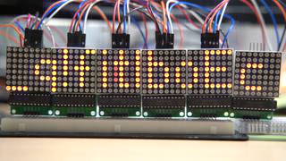

## show your patience 1

#### PART 1



We got string `_q!fitlboEc`


#### PART 2

About the this one, we calculated power-on time (by the number of frames) and got something.

```
[37, 108, 109, 37, 109, 37, 37, 37, 109, 109, 37, 37, 37, 37, 37, 109, 109, 37, 109, 109, 37, 37, 37, 109, 37, 37, 108, 109, 37, 109, 109, 109, 37, 109, 109, 37, 37, 37, 109, 109, 37, 37]
```


and replaced `37` as `.` / `108` or `109` as `-`. So, we got something like below.

```
.--. -...- -... ..--.- -...- ..--.- --.- -...- -..

morse decode result:
P=B_=_Q=D
```


Following `P=B_=_Q=D`, we thought it should be `p=b / q=d` and flipped PART 1 string.

```
_q!fitlboEc

gave (with p=b q=d)

_dit!flpoEc
```


#### PART 3

number of columns == index of the string from PART 1

we calculated them and got `i_did_it!!_i_did_it!!_flip_it_to_dEcodE!!!`

So, flag was `BALSN{i_did_it!!_i_did_it!!_flip_it_to_dEcodE!!!}`