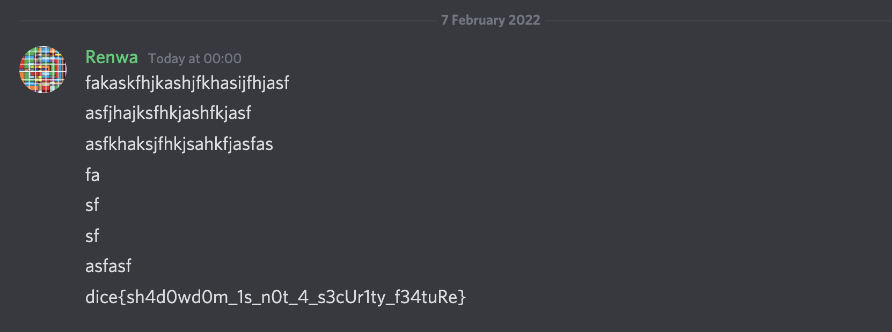

## DiceCTF 2022

**Challenge name:** shadow\
**Author**: arxenix\
**Description:** I found a totally secure way to insert secrets into a webpage\
**URL:** `https://shadow.mc.ax/`\
**Solves:** 0\
**Hints:**
- non-standard css properties might help you
- it sure would be nice if the _user_ could _modify_ stuff inside the shadow dom

**CSP:**
`default-src 'none'; base-uri 'self'; script-src 'self' 'unsafe-inline' 'unsafe-eval'; frame-ancestors 'none';`

**Source Code:**
```html
<!DOCTYPE html>
<html lang="en">
<head>
<meta charset="UTF-8" />
<title>shadow</title>
</head>
<body>
<h3 id="title">store your secrets here:</h3>
<div id="vault"></div>
<div id="xss"></div>
<script>
// the admin has the flag set in localStorage["secret"]
let secret = localStorage.getItem("secret") ?? "dice{not_real_flag}"
let shadow = window.vault.attachShadow({ mode: "closed" });
let div = document.createElement("div");
div.innerHTML = `
<p>steal me :)</p>
<!-- secret: ${secret} -->
`;
let params = new URL(document.location).searchParams;
let x = params.get("x");
let y = params.get("y");
div.style = y;
shadow.appendChild(div);
secret = null;
localStorage.removeItem("secret");
shadow = null;
div = null;
// free XSS
window.xss.innerHTML = x;
</script>
</body>
</html>
```
---

The objective is to steal the secret which it's inside a closed [Shadow](https://developer.mozilla.org/en-US/docs/Web/Web_Components/Using_shadow_DOM) DOM and all document/variable references are set to null before our XSS.\
`y` parameter set our custom style to the shadow element\
`x` parameter is just classic XSS via innerHTML\

**Baby steps**
At first we tried anything we thought of like\
`document.body.outerHTML` doesn't include the shadow\
`vault.children` is empty\
`vault.attachShadow({mode:'open'})` Failed to execute 'attachShadow' on 'Element': Shadow root cannot be created on a host which already hosts a shadow tree.\
`document.designMode='on'` doesn't change shadow\
`vault.contentEditable='true'` nope\
`Embed inside an iframe with sandbox attribute` blocked because of CSP

**Second Hint**\
After a lot of struggle we couldn't find anything useful but all changed after releasing the second hint, (it sure would be nice if the _user_ could _modify_ stuff inside the shadow dom) from the first sight I noticed about two italic words (_user_  _modify_) and I knew it's mentioning non-standard [user-modify](https://developer.mozilla.org/en-US/docs/Web/CSS/user-modify) CSS property, From MDN: `It was originally planned to determine whether or not the content of an element can be edited by a user.`\
It's basically like `document.designMode='on'` now deprecated but chrome still support it via `-webkit-user-modify`, now with this old feature we can edit contents of the shadow element with user gesture and not javascript, `https://shadow.mc.ax/?y=-webkit-user-modify:+read-write`.

**Deprecated feature strikes again**\
After some time we couldn't find a way how this is useful in our case since JS can't access it yet, later [parrot](https://twitter.com/parrot409) found about [document.executeCommand](https://developer.mozilla.org/en-US/docs/Web/API/Document/execCommand) from MDN:
`When an HTML element has contenteditable set to true, the document.execCommand() method is made available. This lets you run commands to manipulate the contents of the editable region. Most commands affect the document's selection by, for example, applying a style to the text (bold, italics, etc), while others insert new elements (like adding a link) or affect an entire line (indenting). When using contentEditable, calling execCommand() will affect the currently active editable element.`

One of execCommand is **insertHTML** description: `Inserts an HTML string at the insertion point (deletes selection). Requires a valid HTML string as a value argument.`\
So in our case if we run `setInterval(()=>(document.execCommand("insertHTML", false, ""),1000)` then click on the `steal me :)` text on the document it will insert the img tag and our code will execute inside the shadow, because our shadow now considered as contentEditable thus execCommand can work on it. 

**Not so fast**\
The time was `22:45` and only an 1:15 minutes was remaining, execCommand will only work on selected/focused elements which is contentEditable or in designMode we tried everything some of our failed attempts:\
Focus using element id and hash `https://shadow.mc.ax/#vault`\
Scroll to text fragment `https://shadow.mc.ax/#:~:text=steal%20me%20%3A)`\
vault.click()\
vault.focus()\
And nothing worked now time is `23:44` (16 minutes remaining) and parrot found the way to focus on the element, again non-standard feature [window.find()](https://developer.mozilla.org/en-US/docs/Web/API/Window/find) `The Window.find() method finds a string in a window sequentially.` strangely find() worked on texts inside the shadow and automatically selects it, by running `find('steal me')` it will select the contents of the shadow now we can run execCommand on it.

**Rush minutes and panic**\
Now only 10 minutes left and we have everything ready, we set style to `-webkit-user-modify:read-write` using `find('steal me')` select the shadow dom then finally with execCommand `document.execCommand('insertHTML',false,'` we can get the secret but out of no where `this.parentElement` returned null `Cannot read properties of null (reading 'outerHTML')`

Only 4 minutes left and we are very very close to solution I didn't knew why img tag behaves like this and this.parenElement is null everything looks perfect but no idea, I thought maybe img is an inline element and it should be standalone so I used `<svg onload>` luckily and strangely it worked now putting it all together
`https://shadow.mc.ax/?y=-webkit-user-modify:+read-write&x=')">`
we got the flag `dice{sh4d0wd0m_1s_n0t_4_s3cUr1ty_f34tuRe}`but will leave you with this image 



We missed sending the flag by 30 seconds which is the saddest thing to happen in a ctf, but right after the ctf ended diceCTF posted this: 
`We also still have some unsolved but really awesome challenges, pwn/nightmare, pwn/road-to-failure, web/shadow. It would be awesome to see these challenges solved and to incentivize this we are offering $50 for the first solver of each challenge.`
We just sent a message to the admins sent our solution and claimed the prize, if we were able to submit in time this reward wouldn't happen. sometimes you never know what is good for you.

Thanks for reading\
[Renwa](https://twitter.com/RenwaX23) && [parrot](https://twitter.com/parrot409)
