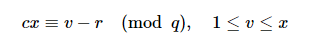

## BabyProof

```python
from hashlib import sha256
 
from Crypto.Util.number import getRandomRange
from Crypto.PublicKey import DSA
 
from secret import proof_of_work, flag
 
 
x = int.from_bytes(flag, 'big')
assert x.bit_length() == 247
 
 
def baby_proof():
    key = DSA.generate(3072)  # It takes time to generate, plz be patient...
    p, q, g = key.domain()
    y = pow(g, x, p)
 
    v = getRandomRange(1, x)
    t = pow(g, v, p)
 
    gyt = b"".join(
        map(
            lambda x: int.to_bytes(len(str(x)), 4, 'big') + str(x).encode(),
            (g, y, t)
        ))
    c = int.from_bytes(sha256(gyt).digest(), 'big')
    r = (v - c*x) % q
 
    print("I want to prove to you that I am in the knowledge of the discrete "
          "logarithm x that satisfies g^x = y modulo p, with the order of g "
          "modulo p being q.")
    print("However, I don't want to leak any information about x.")
    print("So, I use a non-interactive zero-knowledge proof for my purpose.")
    print("=================================================================")
    print("Here is my proof: ")
    print("Firstly, I choose a random (secret) v and compute t = g^v in Zq.")
    print("Secondly, I compute c = SHA256(g, y, t).")
    print("Then, I compute r = v - cx modulo q.")
    print("Finally, I will send you my proof (t, r).")
    print("You can check it by determining whether t == g^r * y^c or not.")
    print("Since there's negligible probability that I could forge the value "
          "r, you should believe that I really have knowledge of x.")
    print(g, y, p, q, t, r, sep="\n")
 
 
if __name__ == "__main__":
    if proof_of_work():
        baby_proof()
```

The key here is that xx is quite small compared to 22562256, and vv is selected in [1,x][1,x]. 

Given the printed parameters, we can directly obtain the value of cc as well. We see that



Since xx's bit length is 247247, we get 1≤v≤22471≤v≤2247 and can write something like


This is an instance of Hidden Number Problem, so just gather a lot of these information and solve it.

```python
d = 60 ## get 60 instances
M = Matrix(ZZ, d+1, d+1)
for i in range(0, d):
    M[0, i] = cs[i]
M[0, d] = 1
for i in range(0, d):
    M[i+1, i] = qs[i]
 
Target = [0] * (d+1)
for i in range(0, d):
    Target[i] = (2 ** 246) - rs[i]
Target[d] = (2 ** 246)
 
M = M.LLL()
GG = M.gram_schmidt()[0]
Target = vector(Target)
TT = Babai_closest_vector(M, GG, Target)
 
x = TT[d]
print(x)
print(bytes.fromhex(hex(x)[2:]))
```

